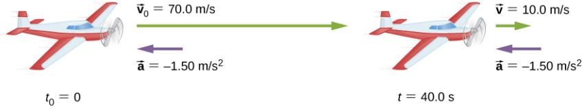

# 🧭 Week 1 — Units, Dimensions & 1D Motion (Illustrated, Tiered Mastery)

Welcome to **Week 1** of College Physics 201.

This module is designed so that a motivated student can **teach themselves** the Week 1 material using:

- Illustrated explanations
- Tiered mastery (core → deeper → advanced)
- Examples and practice with hidden solutions
- Graphs and diagrams from your lecture slides (Ch. 1 & Ch. 3)

---

??? note "0. How to Use This Page"

    === "Core Idea"
        - Each **section is collapsible** — click the bar to expand it.
        - Inside most sections you’ll see tabs:
          - **Core Idea** — what you *must* know
          - **Deeper Reasoning** — why it works and how to think about it
          - **Advanced Application** — calculus, graphs, and more challenging thinking

        - Many problems have **hidden solutions**. Try them before opening the answer.

    === "Deeper Reasoning"
        Learning physics is like building a mental model of how the universe behaves.
        This page is structured so you can:
        - get the *big picture* first
        - then drill into detail only when you’re ready
        - then test yourself

    === "Advanced Application"
        As you go through, ask yourself:
        - *“Where would this show up in real life?”*
        - *“Could I explain this to someone else?”*
        - *“What equation or graph represents this situation?”*

---

??? info "1. Physical Quantities, Units, and Measurement"

    === "Core Idea"
        Physics describes the world using **measurable quantities**:
        - length, time, mass, temperature, etc.
        - each must have a **unit** (meters, seconds, kilograms, kelvins…)

        We use the **SI (International System of Units)** as a common language.

        | Quantity         | Unit     | Symbol |
        |------------------|----------|--------|
        | Length           | meter    | m      |
        | Mass             | kilogram | kg     |
        | Time             | second   | s      |
        | Temperature      | kelvin   | K      |
        | Electric current | ampere   | A      |

        Visual from your slides:

        

    === "Deeper Reasoning"
        A “number” without a unit is **meaningless** in physics.

        Compare:
        - “The car went 30” → 30 *what*?
        - “The car went 30 m” vs “30 mi” vs “30 km” → very different physical situations.

        Units also hide **physical scales**:  
        - meters vs nanometers vs light-years  
        - seconds vs microseconds vs years  

        Your slide likely showing different scales:

        

        This helps students see that **the same laws** apply from atoms to galaxies.

    === "Advanced Application"
        When you later do more advanced physics (EM, quantum, thermo), being sloppy
        with units leads to:
        - wrong answers
        - confusion about what an equation actually means
        - difficulty catching mistakes

        Habit to build now:
        - Always write the unit next to your answer.
        - Always check if unit types “match” on both sides of equations.

---

??? info "2. SI Prefixes and Unit Conversions (Factor–Label Method)"

    === "Core Idea"
        We use **prefixes** to handle very large or small numbers:

        | Prefix | Symbol | Factor      |
        |--------|--------|------------|
        | kilo   | k      | \(10^3\)   |
        | mega   | M      | \(10^6\)   |
        | giga   | G      | \(10^9\)   |
        | milli  | m      | \(10^{-3}\)|
        | micro  | μ      | \(10^{-6}\)|
        | nano   | n      | \(10^{-9}\)|

        From your slides:

        

        We do conversions using the **factor–label method** (multiplying by 1 cleverly).

    === "Deeper Reasoning"
        Example: Convert 60 mph to m/s

        \[
        60\ \frac{\text{mi}}{\text{hr}}
        \cdot
        \frac{1609\ \text{m}}{1\ \text{mi}}
        \cdot
        \frac{1\ \text{hr}}{3600\ \text{s}}
        =
        26.8\ \text{m/s}
        \]

        Each “conversion factor” is just a fancy version of:

        \[
        \frac{\text{same quantity in different units}}{\text{same quantity in original units}} = 1
        \]

        So we are multiplying by 1, but in a way that changes units.

    === "Advanced Application"
        In more advanced problems, you might convert:
        - km/h to m/s  
        - g/cm\(^3\) to kg/m\(^3\)  
        - J to eV (electron-volts)

        Practice problem:

        Convert \( 3.5\ \text{g/cm}^3 \) into kg/m\(^3\).

        ??? success "Show Solution"
            \[
            3.5\ \frac{\text{g}}{\text{cm}^3}
            \cdot
            \frac{1\ \text{kg}}{1000\ \text{g}}
            \cdot
            \left(\frac{100\ \text{cm}}{1\ \text{m}}\right)^3
            =
            3.5 \cdot \frac{1}{1000} \cdot (10^6)
            = 3500\ \frac{\text{kg}}{\text{m}^3}
            \]

---

??? note "3. Dimensions and Dimensional Analysis"

    === "Core Idea"
        Dimensions represent the **type of quantity**, not the unit.

        - Length: \([L]\)
        - Time: \([T]\)
        - Mass: \([M]\)

        Examples:
        \[
        \text{Velocity} : [L][T^{-1}]
        \]
        \[
        \text{Acceleration} : [L][T^{-2}]
        \]
        \[
        \text{Force} : [M][L][T^{-2}]
        \]

        You can use dimensions to **check if an equation could possibly be correct**.

    === "Deeper Reasoning"
        Suppose someone proposes:

        \[
        v = 3t + 7x
        \]

        - Left-hand side: \(v \rightarrow [L/T]\)  
        - Right-hand side:
          - \(3t \rightarrow [T]\)
          - \(7x \rightarrow [L]\)

        You **cannot** add \([T]\) and \([L]\).  
        Therefore, the equation is nonsense physically.

        Dimensional analysis doesn’t prove an equation is right, but it can tell you if it’s **definitely wrong**.

    === "Advanced Application"
        Often, we know:
        - the relevant quantities (e.g., \(g\), \(h\), \(v_0\)), and  
        - the dimension we want (e.g., time [T])

        Dimensional analysis can guide us to plausible forms of relationships.

        It’s also very helpful in checking your work in exams.

        Visual from your slides:

        

---

??? info "4. Position and Displacement Along a Line"

    === "Core Idea"
        **Position** \(x(t)\) tells you where an object is along a 1D axis.  
        **Displacement** is the change in position:

        \[
        \Delta x = x_f - x_i
        \]

        It can be positive (forward), negative (backwards) or zero.

        From your Ch. 3 slides:

        

    === "Deeper Reasoning"
        Position depends on your **choice of origin**.  
        If you choose \(x=0\) at one place vs another, the numeric values change, but
        **physics does not**.

        Displacement cares only about start and end, not the path taken.

    === "Advanced Application"
        If \(x(t)\) is given as a function (e.g., a polynomial), we can:
        - compute displacement over a time interval: \(x(t_2)-x(t_1)\)
        - compute average velocity: \(\frac{\Delta x}{\Delta t}\)

        Example:

        \[
        x(t) = 2t^2 - 4t + 1
        \]
        From \(t=1\) to \(t=3\):

        \[
        \Delta x = x(3)-x(1)
        \]

        ??? success "Show Solution"
            \[
            x(3)=2(9)-4(3)+1=18-12+1=7
            \]
            \[
            x(1)=2(1)-4(1)+1=2-4+1=-1
            \]
            \[
            \Delta x = 7 - (-1) = 8\ \text{m}
            \]

---

??? note "5. Average vs Instantaneous Velocity"

    === "Core Idea"
        **Average velocity** over a time interval:

        \[
        \bar{v} = \frac{\Delta x}{\Delta t}
        \]

        **Instantaneous velocity** is the velocity at one instant:

        \[
        v(t) = \frac{dx}{dt}
        \]

        On a position–time graph:
        - average velocity ↔ slope of a secant line  
        - instantaneous velocity ↔ slope of the tangent line

        From your slides:

        

    === "Deeper Reasoning"
        Average velocity is like “overall change”:  
        *“From 1:00 to 1:05, my position changed by 500 m, so on average I moved 100 m/min.”*

        Instantaneous velocity zooms in on one time:
        *“Exactly at 1:02:30, what was my speed and direction?”*

        Conceptual graph from your slides:

        

    === "Advanced Application"
        Given:
        \[
        x(t) = t^3 - 4t + 2
        \]

        - Average velocity from \(t=1\) to \(t=2\)
        - Instantaneous velocity at \(t=1\)

        ??? success "Show Solution"
            \[
            v(t) = \frac{dx}{dt} = 3t^2 - 4
            \]

            **Average** from 1 to 2:

            \[
            x(2) = 8 - 8 + 2 = 2
            \]
            \[
            x(1) = 1 - 4 + 2 = -1
            \]
            \[
            \bar{v} = \frac{2 - (-1)}{2-1} = 3\ \text{m/s}
            \]

            **Instantaneous** at \(t=1\):

            \[
            v(1) = 3(1)^2-4 = -1\ \text{m/s}
            \]

            Negative means motion is in the negative direction at that instant.

---

??? info "6. Acceleration: Changing Velocity"

    === "Core Idea"
        **Acceleration** is the rate of change of velocity:

        \[
        a(t) = \frac{dv}{dt}
        \]

        On a velocity–time graph:
        - the slope is the acceleration

        Slide illustration:

        

    === "Deeper Reasoning"
        There are several ways velocity can change:
        - speed increases
        - speed decreases
        - direction reverses

        All of these involve **acceleration**, even if the speed is momentarily zero.

        For constant acceleration:
        \[
        a = \text{constant}
        \Rightarrow v(t) = v_0 + at,\quad x(t) = x_0 + v_0 t + \frac{1}{2}at^2
        \]

    === "Advanced Application"
        Suppose:
        \[
        a(t) = 6t,\quad v(0) = 3,\quad x(0)=0
        \]

        Then:
        \[
        v(t) = \int 6t\,dt = 3t^2 + C
        \]

        Using \(v(0)=3\):
        \[
        3(0)^2 + C = 3 \Rightarrow C = 3
        \]

        \[
        v(t) = 3t^2+3
        \]

        Then:
        \[
        x(t) = \int (3t^2+3)\,dt = t^3 + 3t + C_2
        \]

        Using \(x(0)=0\) gives \(C_2=0\).

        \[
        x(t) = t^3 + 3t
        \]

---

??? note "7. Free Fall & Constant Acceleration (1D Kinematics)"

    === "Core Idea"
        Near Earth’s surface, ignoring air resistance:

        \[
        a = g \approx 9.8\ \text{m/s}^2 \quad (\text{downward})
        \]

        If we take upward as positive, then:

        \[
        a = -g
        \]

        Kinematic equations (constant acceleration):

        \[
        v = v_0 + at
        \]
        \[
        x = x_0 + v_0 t + \frac{1}{2}at^2
        \]
        \[
        v^2 = v_0^2 + 2a(x - x_0)
        \]

        Your slide visual:

        

    === "Deeper Reasoning"
        Free fall includes:
        - dropping an object (\(v_0 = 0\))
        - throwing an object upward
        - throwing an object downward

        All share:
        - same acceleration magnitude (if air resistance is negligible)
        - parabolic position–time graphs  
        - linear velocity–time graphs

    === "Advanced Application"
        **Example — Dropped from 20 m**

        \[
        x_0 = 20\ \text{m},\quad v_0 = 0,\quad a=-9.8\ \text{m/s}^2
        \]

        Position:

        \[
        x(t) = 20 + 0\cdot t + \frac{1}{2}(-9.8)t^2 = 20 - 4.9 t^2
        \]

        Time to hit the ground: set \(x(t)=0\):

        \[
        20 - 4.9t^2 = 0 \Rightarrow t^2=\frac{20}{4.9}
        \Rightarrow t \approx 2.02\ \text{s}
        \]

        Velocity on impact:

        \[
        v = v_0 + at = -9.8(2.02) \approx -19.8\ \text{m/s}
        \]

        Negative indicates downward direction.

---

??? example "8. Worked Examples (Tiered)"

    === "Core Idea"
        **Example 1 — From Position to Velocity and Acceleration**

        \[
        x(t) = 4t^3 - 2t
        \]

        \[
        v(t) = 12t^2 - 2
        \]

        \[
        a(t) = 24t
        \]

        Graph-style slide:

        

    === "Deeper Reasoning"
        - Position is cubic → velocity quadratic → acceleration linear.
        - As time increases:
          - velocity grows faster
          - acceleration keeps changing (not constant)

    === "Advanced Application"
        **Example 2 — Car Accelerating from Rest**

        A car starts from rest and accelerates at \(4\ \text{m/s}^2\) for 5 s.

        \[
        v = v_0 + at = 0 + 4(5) = 20\ \text{m/s}
        \]

        \[
        x = x_0 + v_0 t + \frac{1}{2}at^2
        = 0 + 0 + \frac{1}{2}(4)(25) = 50\ \text{m}
        \]

        **Example 3 — Free-Fall Upward Throw**

        A ball is thrown upward at \(12\ \text{m/s}\).  
        Maximum height (using \(v^2 = v_0^2 + 2a\Delta x\) with final \(v=0\)):

        \[
        0 = (12)^2 + 2(-9.8)\Delta x
        \Rightarrow \Delta x = \frac{144}{19.6} \approx 7.35\ \text{m}
        \]

---

??? question "9. Practice Problems (Try First, Then Expand)"

    === "Core Idea"
        1. Given \(x(t)=2t^3 - 5t^2 + 7\), find \(v(t)\) and \(a(t)\).  
        2. A car accelerates from rest at \(4\ \text{m/s}^2\) for 5 s. Find distance traveled.  
        3. A ball is thrown upward at \(12\ \text{m/s}\). Find max height.  
        4. Convert 45 mph to m/s.  
        5. If \(v(t)=6t\) and \(x(0)=0\), find \(x(t)\).

    === "Deeper Reasoning"
        Think for each:
        - What is given? (position? velocity? acceleration?)  
        - Do I need a **derivative** or **integral**?  
        - Is this **constant acceleration**?

    === "Advanced Application & Solutions"

        ??? success "Problem 1 Solution"
            \[
            x(t)=2t^3 - 5t^2 + 7
            \]
            \[
            v(t)=\frac{dx}{dt}=6t^2 - 10t
            \]
            \[
            a(t)=\frac{dv}{dt}=12t - 10
            \]

        ??? success "Problem 2 Solution"
            \[
            x = \frac{1}{2}at^2 = \frac{1}{2}(4)(25)=50\ \text{m}
            \]

        ??? success "Problem 3 Solution"
            \[
            h = \frac{v_0^2}{2g} = \frac{144}{19.6} \approx 7.35\ \text{m}
            \]

        ??? success "Problem 4 Solution"
            \[
            45\ \text{mph} \approx 20.1\ \text{m/s}
            \]

        ??? success "Problem 5 Solution"
            \[
            v(t)=6t
            \Rightarrow x(t)=\int 6t\,dt = 3t^2 + C
            \]
            Using \(x(0)=0\) gives \(C=0\). Thus:
            \[
            x(t)=3t^2
            \]

---

??? info "10. Summary Sheet (Exam-Focused)"

    === "Core Idea"
        **Definitions**

        \[
        v(t)=\frac{dx}{dt}
        \qquad
        a(t)=\frac{dv}{dt}
        \]

        **Constant-Acceleration Equations**

        \[
        v = v_0 + at
        \]
        \[
        x = x_0 + v_0 t + \frac{1}{2}at^2
        \]
        \[
        v^2 = v_0^2 + 2a(x-x_0)
        \]

        **Key Ideas**

        - Units & dimensions must be consistent.
        - Derivative ↔ slope of graph.
        - Integral ↔ area under graph.
        - Free fall ≈ constant acceleration due to gravity.

    === "Deeper Reasoning"
        Ask yourself if you can:
        - explain what each symbol means physically  
        - sketch a rough graph for each motion situation  
        - decide which equation to use based on what’s known  

    === "Advanced Application"
        On a test, the **hardest** problems often combine:
        - reading a graph  
        - interpreting a word problem  
        - choosing a kinematic equation  
        - performing a unit conversion  
        - checking units/dimensions at the end

        Practice spotting all of these elements in a single problem.

---

