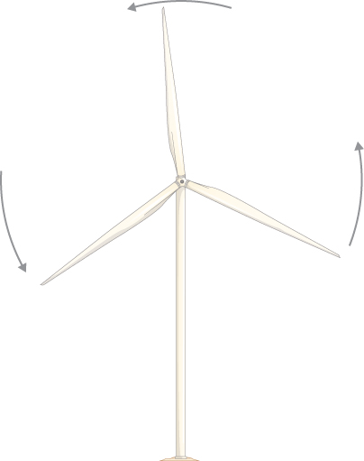

# 🌀 Week 7 — Rotational Motion  
### Understanding Rotation Through What You Already Know

Rotational motion is one of the hardest topics in physics — not because the ideas are new, but because the *language* changes.  
This module rewrites everything using what you already understand from Weeks 1–6.

---

# ⭐ 1. Rotational Motion & Linear Motion: The Master Connection  
## 1.1 Why Rotation Feels Hard — and Why It Shouldn’t

??? info "Linear → Rotational Analogy (The Foundation)"

    === "Core Idea"

        Rotational motion is just **linear motion wrapped into a circle**.

        Every linear quantity has a rotational partner:

        | Linear | Rotational | Meaning |
        |--------|------------|---------|
        | \(x\) | \(\theta\) | Position (angle) |
        | \(v\) | \(\omega\) | Velocity |
        | \(a\) | \(\alpha\) | Acceleration |
        | \(m\) | \(I\) | Resistance to motion |
        | \(F\) | \(\tau\) | Cause of acceleration |
        | \(p = mv\) | \(L = I\omega\) | Momentum |
        | \(K = \tfrac12 mv^2\) | \(K = \tfrac12 I\omega^2\) | Kinetic energy |

        Understanding this chart makes everything else easier.

    === "Deeper Reasoning"

        Rotation **inherits** the mathematics of linear motion:
        - Derivatives describe change
        - Integrals accumulate change
        - Forces (or torques) cause acceleration
        - Mass (or inertia) resists acceleration

        The physics does **not** change — only the *geometry* and terminology do.

        This is why you can rely on Weeks 1–6 such as:
        - Kinematics
        - Free-body diagrams
        - Energy
        - Momentum

        Rotation is simply those ideas in circular form.

    === "Advanced Application"

        Total relationships:

        \[
        \omega = \frac{d\theta}{dt}, \qquad \alpha = \frac{d\omega}{dt}
        \]

        Constant acceleration gives rotational kinematic equations:

        \[
        \omega = \omega_0 + \alpha t
        \]
        \[
        \theta = \theta_0 + \omega_0 t + \tfrac12\alpha t^2
        \]
        \[
        \omega^2 = \omega_0^2 + 2\alpha(\theta-\theta_0)
        \]

---

# ⭐ 2. Angular Variables: θ, ω, α  
## 2.1 What “Angle” Really Represents

??? info "Understanding θ, ω, α"

    === "Core Idea"

        - **Angular position (θ):** where the object is on a circle  
        - **Angular velocity (ω):** how fast the angle changes  
        - **Angular acceleration (α):** how fast ω changes  

        

    === "Deeper Reasoning"

        These three values behave exactly like:
        - position → \(x(t)\)  
        - velocity → \(v(t) = \frac{dx}{dt}\)  
        - acceleration → \(a(t) = \frac{dv}{dt}\)

        The only difference is:
        - Angle measures **rotation**, not distance.

        But calculus works the same.

    === "Advanced Application"

        **Connecting linear & rotational motion:**

        \[
        s = r\theta
        \]

        The arc length \(s\) is a linear displacement across the circle.

        Tangential velocity:
        \[
        v = r\omega
        \]

        Tangential acceleration:
        \[
        a_t = r\alpha
        \]

        Centripetal acceleration:
        \[
        a_c = \omega^2 r
        \]

---

# ⭐ 3. Torque — The Rotational Equivalent of Force  
## 3.1 Why Force Alone Cannot Tell You How Something Rotates

??? info "Torque (τ): The Cause of Angular Acceleration"

    === "Core Idea"

        Torque tells you how effectively a force **creates rotation**.

        \[
        \tau = rF_\perp
        \]

        - \(r\): distance from pivot  
        - \(F_\perp\): the perpendicular component of the force  

        

    === "Deeper Reasoning"

        Why the angle matters:

        - Pulling perpendicular → **maximum torque**  
        - Pulling at an angle → **less torque**  
        - Pulling directly toward pivot → **zero torque**

        Perpendicular force:
        \[
        F_\perp = F\sin\theta
        \]

        So torque is:
        \[
        \tau = rF\sin\theta
        \]

    === "Advanced Application"

        **Right-Hand Rule (simplified):**
        - Curl fingers from \(r\) → \(F\)
        - Thumb direction = torque direction  
          - Out of page: counterclockwise (+)  
          - Into page: clockwise (–)

        

---

# ⭐ 4. Moment of Inertia (I): How Hard It Is to Rotate Something  
## 4.1 The Rotational Version of “Mass”

??? info "Moment of Inertia (I)"

    === "Core Idea"

        \[
        I = \sum mr^2
        \]

        Mass far from the axis contributes **a lot** to \(I\).  
        Mass near the axis contributes **little**.

        

    === "Deeper Reasoning"

        Students struggle because inertia feels abstract.  
        Here's the intuition:

        - A baseball bat is easier to swing when held near the thick end  
          (mass closer → smaller I)  
        - A skater spins faster with arms in  
          (decreasing r decreases I)

        **Distribution matters more than total mass.**

    === "Advanced Application"

        **Parallel Axis Theorem**

        \[
        I = I_{\text{cm}} + md^2
        \]

        Used whenever the pivot is **not** at the center of mass.

---

# ⭐ 5. Newton’s Second Law for Rotation  
## 5.1 The Torque Version of F = ma

??? info "τ = Iα"

    === "Core Idea"

        \[
        \tau_{\text{net}} = I\alpha
        \]

        Torque causes angular acceleration in the same way force causes linear acceleration.

        

    === "Deeper Reasoning"

        To solve rotational problems:
        1. Draw free-body diagram  
        2. Choose pivot  
        3. Determine which forces cause torque  
        4. Assign torque signs  
        5. Apply \(\sum \tau = I\alpha\)

        Critical reminders:
        - Only **perpendicular force** counts  
        - Torques have signs (CW / CCW matter)

    === "Advanced Application"

        **Pulley systems** often require:

        \[
        Tr = I\alpha
        \]
        and  
        \[
        a = r\alpha
        \]

        Letting you link rotational + linear motion.

---

# ⭐ 6. Rolling Without Slipping  
## 6.1 Why Wheels Don’t Slide (Most of the Time)

??? info "The Condition v = rω"

    === "Core Idea"

        Rolling without slipping means:

        - Bottom point is instantaneously at rest  
        - Wheel grips the ground  
        - Linear & rotational motion are linked:

        \[
        v = r\omega
        \]

        

    === "Deeper Reasoning"

        The wheel actually has **three velocities**:

        - Top: \(2v\)  
        - Center: \(v\)  
        - Bottom: \(0\)

        Because rotational and translational motion add/subtract.

        

    === "Advanced Application"

        Total kinetic energy:

        \[
        K = \tfrac12 mv^2 + \tfrac12 I\omega^2
        \]

        Substitute \(v = r\omega\):

        \[
        K = \tfrac12 mv^2 + \tfrac12 I\left(\frac{v}{r}\right)^2
        \]

---

# ⭐ 7. Worked Examples (Textbook Quality)  
## These are written step-by-step for mastery.

??? info "Example 1 — Torque from an Angled Force"

    === "Core Idea"

        A 0.25 m wrench with a 120 N force applied at 90°:

        \[
        \tau = rF = (0.25)(120)=30\ \text{N·m}
        \]

    === "Deeper Reasoning"

        If applied at 30°:

        \[
        \tau = rF\sin30^\circ
        \]
        \[
        \tau = (0.25)(120)(0.5)=15\ \text{N·m}
        \]

    === "Advanced Application"

        If force is NOT applied at the end:

        \[
        \tau = (r_{\text{new}})F\sin\theta
        \]

        

---

??? info "Example 2 — Rolling Cylinder"

    === "Core Idea"

        Cylinder: \(I = \tfrac12 mr^2\), moving at 4 m/s

        \[
        \omega = \frac{v}{r}
        \]

    === "Deeper Reasoning"

        Total KE:

        \[
        K = \tfrac12 mv^2 + \tfrac12 I\omega^2
        \]
        \[
        = \tfrac12 mv^2 + \tfrac14 mv^2 = \tfrac34 mv^2
        \]

    === "Advanced Application"

        Same method works for:
        - spheres  
        - hoops  
        - disks  

---

??? info "Example 3 — Angular Acceleration from Torque"

    === "Core Idea"

        Disk (2 kg, r=0.20 m), F_tan=10 N.

        \[
        \tau = rF = 2\ \text{N·m}
        \]

    === "Deeper Reasoning"

        Moment of inertia:

        \[
        I = \tfrac12 mr^2 = 0.04
        \]

        \[
        \alpha = \frac{\tau}{I} = 50\ \text{rad/s}^2
        \]

    === "Advanced Application"

        A tension-based pulley system follows the same pattern.

---

# ⭐ 8. Practice Problems (Hidden Solutions)

??? info "Try These First"

    === "Core Idea"

        1. A 15 N force at 45° acts 0.40 m from pivot. Find torque.  
        2. A disk rolls at 3 m/s. Find ω.  
        3. A rod (2 kg, 1.2 m) pivots at end. Find I_end.  
        4. A wheel accelerates from 2 to 8 rad/s in 3s. Find α.  
        5. A 6 kg cylinder rolls at 5 m/s. Find total KE.

    === "Deeper Reasoning"

        These cover:
        - torque  
        - rolling motion  
        - parallel axis theorem  
        - rotational energy  
        - angular acceleration  

    === "Advanced Application"

        **Solutions:**

        1.  
        \[
        \tau = rF\sin\theta = (0.40)(15)(\sin45^\circ)=4.24
        \]

        2.  
        \[
        \omega = \frac{v}{r}
        \]

        3.  
        \[
        I_{\text{cm}} = \tfrac{1}{12}mL^2 = 0.24
        \]
        \[
        I_{\text{end}} = I_{\text{cm}} + md^2 = 0.96
        \]

        4.  
        \[
        \alpha = \frac{\Delta\omega}{t} = \frac{8-2}{3}=2
        \]

        5.  
        \[
        K = \tfrac12 mv^2 + \tfrac12 I\omega^2
        \]

---

# ⭐ 9. Summary Sheet (Exam Essentials)

\[
\tau = rF\sin\theta
\]
\[
I = \sum mr^2
\]
\[
\tau = I\alpha
\]
\[
v = r\omega
\]
\[
a_t = r\alpha \qquad a_c = \omega^2 r
\]
\[
K = \tfrac12 mv^2 + \tfrac12 I\omega^2
\]

---

