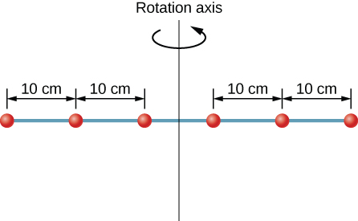
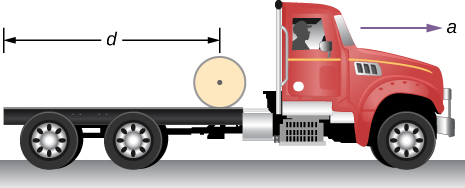

# 📘 Week 7 — Rotational Motion  
*College Physics 201 — Calculus-Based Physics*

Rotational motion is the natural continuation of everything you've done with **kinematics**, **forces**, **energy**, and **momentum** — but now extended into circular and rigid-body motion.

In this module we will unify:

- Linear vs. rotational analogies  
- Angular variables (θ, ω, α)  
- Torque (τ)  
- Moment of inertia (I)  
- Newton’s 2nd Law for rotation:  
  $$
  \tau_{\text{net}} = I\alpha
  $$
- Rolling without slipping  
- Rotational kinetic energy  
- Angular momentum (L)  
- Conservation of angular momentum  
- Precession & gyroscopic motion  

---

# 🧭 **Navigation**
- [Rotational Kinematics](#rotational-kinematics)
- [Torque](#torque)
- [Moment of Inertia](#moment-of-inertia)
- [Rotational Dynamics](#rotational-dynamics)
- [Rolling Without Slipping](#rolling-without-slipping)
- [Rotational Energy](#rotational-energy)
- [Angular Momentum](#angular-momentum)
- [Conservation of Angular Momentum](#conservation-of-angular-momentum)
- [Gyroscopes & Precession](#gyroscopes--precession)
- [Examples](#worked-examples)
- [Practice Problems](#practice-problems)

---

# 🔵 Rotational Kinematics
## **Angular Variables and Circular Motion**

=== "Core Idea"
    Angular motion is described using **three primary variables**:

    $$
    \theta \quad \omega = \frac{d\theta}{dt} \quad \alpha = \frac{d\omega}{dt}
    $$

    - **θ** — angular position (radians)  
    - **ω** — angular velocity (rad/s)  
    - **α** — angular acceleration (rad/s²)

    **Radians** are dimensionless. They make calculus work seamlessly.

    

=== "Deeper Reasoning"
    Hewitt explains rotational motion conceptually as *“turning instead of sliding.”*  
    Instead of describing how far something moves, we describe how **much it turns**.

    If an object rotates through angle θ, every point on it sweeps out an arc:
    $$
    s = r\theta
    $$

    This leads to:
    $$
    v = r\omega
    $$
    $$
    a_t = r\alpha
    $$

    Circular motion has **two accelerations**:
    $$
    a_t = r\alpha \quad\text{(tangential, changes speed)}
    $$
    $$
    a_c = \omega^2 r \quad\text{(centripetal, changes direction)}
    $$

=== "Advanced Applications"
    - Hard drives  
    - Gears and pulleys  
    - Rotating machinery  
    - Planetary rotations  

    

---

# 🔵 Torque
## **The Cause of Rotational Motion**

=== "Core Idea"
    Torque determines how effectively a force causes rotation.

    $$
    \tau = rF\sin\theta
    $$

    Where:
    - **r** = lever arm  
    - **F** = applied force  
    - **θ** = angle between r and F  

    

=== "Deeper Reasoning"
    From Hewitt: *“You can push hard on a door and still fail to open it if you push the wrong way.”*

    - Perpendicular force → **max torque**  
    - Parallel force → **zero torque**  

    Torque direction uses the **right-hand rule**:

    

=== "Advanced Applications"
    - Wrenches and tools  
    - Human joints  
    - Bicycles  
    - Torque on pulleys  

---

# 🔵 Moment of Inertia
## **Rotational Inertia: The Rotational Form of Mass**

=== "Core Idea"
    $$
    I = \sum m r^2
    $$

    Mass far from the axis contributes **more** to inertia.

    

=== "Deeper Reasoning"
    Knight emphasizes:  
    *“Rotational inertia is not just about how much mass — it’s about where that mass is distributed.”*

    Example:
    - Solid disk → small I  
    - Hoop → large I (all mass at the rim)

    

=== "Advanced Applications"
    Parallel-axis theorem:
    $$
    I = I_{cm} + Md^2
    $$

    Useful for rods, doors, rotating limbs.

    

---

# 🔵 Rotational Dynamics
## **Newton’s Second Law for Rotation**

=== "Core Idea"
    $$
    \tau_{\text{net}} = I\alpha
    $$

=== "Deeper Reasoning"
    This is the rotational form of:
    $$
    F_{\text{net}} = ma
    $$

    If you apply more torque:
    - Angular acceleration increases  
    - Rotation direction depends on sign of torque  
    - Mass distribution (I) determines resistance  

    

=== "Advanced Applications"
    Pulley systems:
    

---

# 🔵 Rolling Without Slipping
## **Translation + Rotation Combined**

=== "Core Idea"
    The rolling condition:
    $$
    v = r\omega
    $$

    Bottom point: momentarily at rest  
    Top point: moving at 2v  

    

=== "Deeper Reasoning"
    Hewitt:  
    *“Rolling is walking and spinning at the same time.”*

    Static friction provides the link — but does **no work**.

=== "Advanced Applications"
    - Bicycles  
    - Rolling robots  
    - Car wheels  
    - Bowling balls  

---

# 🔵 Rotational Energy
## **Energy of Rolling Objects**

=== "Core Idea"
    $$
    K_{\text{tot}} = \frac12 mv^2 + \frac12 I\omega^2
    $$

=== "Deeper Reasoning"
    Shapes with **smaller I** accelerate faster down a ramp.

=== "Advanced Applications"
    Energy diagrams:
    

---

# 🔵 Angular Momentum
## **Rotational Equivalent of Linear Momentum**

=== "Core Idea"
    $$
    L = I\omega
    $$

    Direction given by the right-hand rule.

    

=== "Deeper Reasoning"
    Hewitt’s intuitive model:
    - A spinning object “wants” to keep spinning  
    - More rotational inertia → harder to change ω  

=== "Advanced Applications"
    Figure skater diagrams:
    

---

# 🔵 Conservation of Angular Momentum
## **When No Net External Torque Acts…**

=== "Core Idea"
    $$
    L_i = L_f
    $$  
    $$
    I_i \omega_i = I_f \omega_f
    $$

=== "Deeper Reasoning"
    - Skaters pull arms in → spin faster  
    - Neutron stars collapse → rotate extremely fast  

=== "Advanced Applications"
    Planetary formation, collapsing stellar cores.

---

# 🔵 Gyroscopes & Precession
## **Why Spinning Objects Defy Intuition**

=== "Core Idea"
    Precession occurs when torque acts **perpendicular** to angular momentum.

    

=== "Deeper Reasoning"
    Hewitt’s insight:  
    *“A gyroscope does not fall — it moves sideways.”*

    Because:
    $$
    \vec{\tau} = \frac{d\vec{L}}{dt}
    $$

---

# 🧩 Worked Examples

## Example 1 — Torque
A 0.30 m wrench is used to exert a 120 N force at 90°.

$$
\tau = rF = (0.30)(120) = 36\text{ N·m}
$$

## Example 2 — Rotational Dynamics
A disk (m = 2.0 kg, r = 0.20 m) has force 10 N applied tangentially.

1. $$
   \tau = rF = 2.0\text{ N·m}
   $$
2. $$
   I = \frac12 mr^2 = 0.04
   $$
3. $$
   \alpha = \frac{\tau}{I} = 50\text{ rad/s}^2
   $$

---

# 📝 Practice Problems

=== "Try These"
1. Compute $\omega$ after 3 seconds if $\alpha = 4 \text{ rad/s}^2$ from rest.  
2. A force of 15 N is applied at 60° to a 0.40 m bar. Find τ.  
3. Determine $I$ for a hoop of mass 2 kg and radius 0.5 m.  
4. A skater pulls arms in and reduces I to half. What happens to ω?  
5. A rolling sphere (I = 2/5 mr²) goes down a ramp. Compare to a cylinder.

=== "Solutions"
1. $\omega = 12\text{ rad/s}$  
2. $\tau = 5.2\text{ N·m}$  
3. $I = 0.5\text{ kg·m}^2$  
4. ω doubles  
5. Sphere accelerates faster

